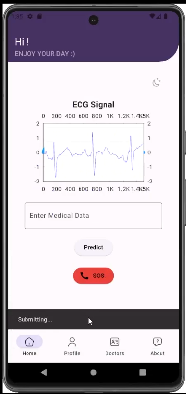
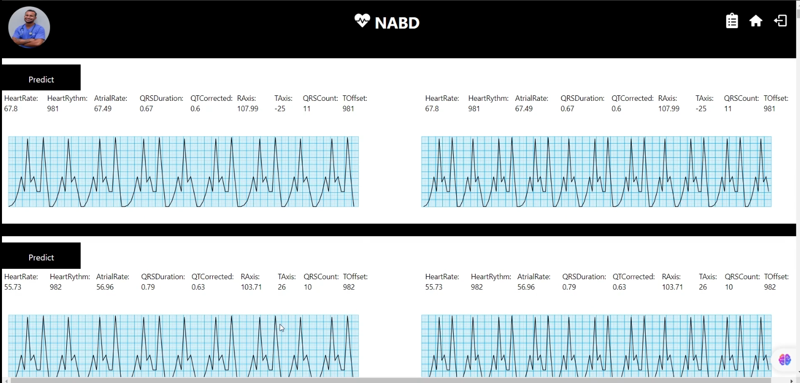

# ❤️ Nabd - Heart Monitoring System

A real-time heart monitoring system designed to reduce cardiac-related deaths by leveraging AI, wearable devices, and mobile/web applications for continuous and accessible patient care.

## 📌 Overview

**Nabd** addresses the rising global and local rates of cardiovascular diseases by providing an AI-powered, low-cost, and easy-to-use system that enables:
- Continuous heart monitoring
- Real-time ECG analysis
- Remote doctor-patient communication
- Early detection and prediction of cardiac events

Developed as part of a graduation project at **Arab International University (AIU)**, Syria.

---

## ⚙️ Tech Stack

- **Frontend**: Flutter (mobile app)
- **Backend**: Django + Django REST Framework
- **AI Model**: XGBoost for ECG prediction
- **Hardware**: AD8232 ECG sensor, Arduino Uno, Raspberry Pi
- **Communication**: Bluetooth, HTTP APIs
- **Database**: PostgreSQL
- **Testing**: Postman

---

## 💡 Key Features

### 👨‍⚕️ Doctor
- View & manage patients
- View ECG data and AI predictions
- Update profile
- Add/delete patients

### 🧑‍💻 Patient
- Live heart signal monitoring
- Request prediction from AI
- Access medical history and insights
- View doctors and contact info

### 🛠️ Admin
- Manage doctors & patients
- Verify doctor identities (certificate/ID images)
- Assign patients to doctors

---

## 🧠 AI Model

- **Model**: XGBoost (ensemble learning)
- **Input**: 1000-value frames of ECG data
- **Signal Processing**: Bandpass filter, Savitzky-Golay smoothing
- **Feature Extraction**: Detection of P, Q, R, S, and T waves
- **Accuracy**: ~90% on test data

---

## 🧪 Testing

- Functional testing via test suites for:
  - Registration & login
  - Patient assignment
  - ECG prediction validation
- JWT authentication and encryption for security

---

## 📱 UI/UX Design

- Built from scratch using Flutter
- Dual themes: Light and Dark
- Intuitive interfaces for patient & doctor dashboards

---
### Mobile App View

---

### Doctor Dashboard View

